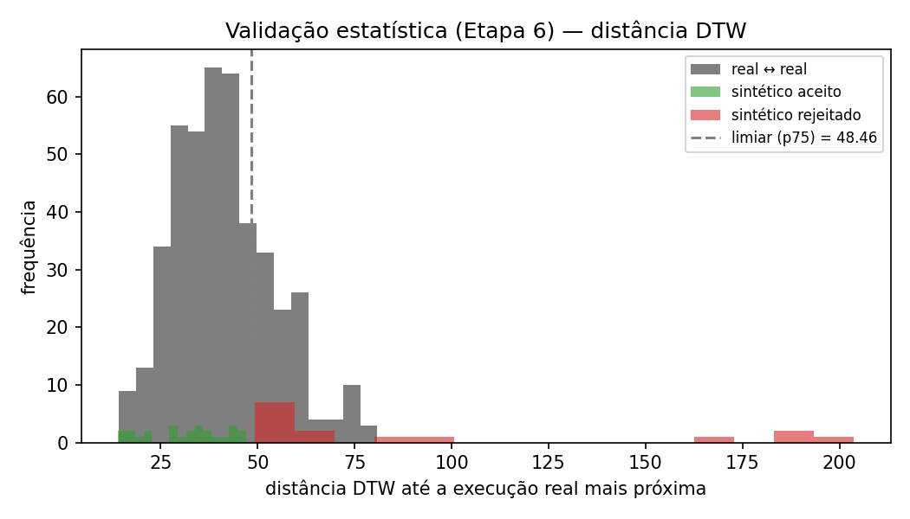
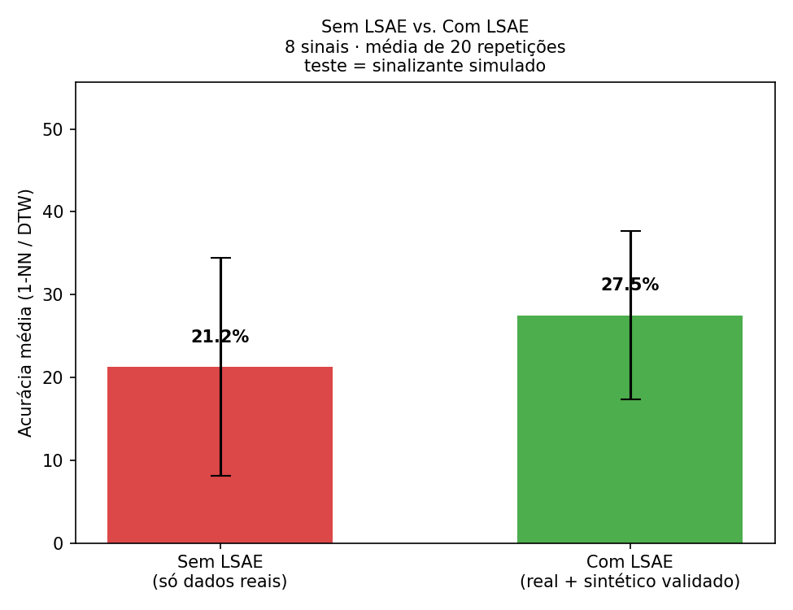

<div align="center">

# 🤟✋ LSAE — Libras Semantic Augmentation Engine 🖐️🤟

### Ensinando um computador a entender que "CASA" continua sendo "CASA", não importa quem sinalize

</div>

---

## 👋 O que é isso?

Imagine ensinar um sistema de computador a reconhecer sinais de Libras. Você grava alguns vídeos de uma pessoa fazendo cada sinal, treina um modelo de inteligência artificial em cima disso... e ele funciona muito bem. Só que quando **outra pessoa** faz exatamente o mesmo sinal na frente da câmera, o sistema simplesmente não reconhece.

O **LSAE (Libras Semantic Augmentation Engine)** nasceu para resolver exatamente esse problema: um motor que gera novas variações sintéticas e biomecanicamente coerentes de cada sinal — mãos maiores, menores, ângulos de câmera diferentes, pequenas variações de execução — sem nunca deixar de ser, de fato, o mesmo sinal.

Não é um projeto acadêmico só no papel: este repositório já traz um **experimento executável**, rodado em cima de dados reais, com resultado mensurado. 👇

---

## ✋ De onde veio essa ideia

O LSAE surgiu de uma dificuldade real do **[KONECTA](https://github.com/vinicebas1234/KONECTA)**, projeto de TCC de reconhecimento de sinais em Libras por visão computacional.

O KONECTA usa câmera + [MediaPipe](https://developers.google.com/mediapipe) para extrair os pontos-chave (landmarks) da mão em tempo real, e um modelo de machine learning para reconhecer o sinal. Só que, com poucos vídeos por sinal e poucos sinalizantes diferentes no dataset (algo como 3 execuções por sinal), o modelo aprendia características de **quem gravou** — tamanho de mão, estilo, ângulo de câmera favorito — em vez do que de fato define o sinal. Resultado: excelente com quem gravou, ruim com qualquer outra pessoa.

Gravar milhares de vídeos com centenas de intérpretes diferentes resolveria, mas não escala. O LSAE é a resposta a essa pergunta: **dá para ensinar o modelo a generalizar sem precisar gravar um exército de vídeos novos?**

🔗 Conheça o projeto principal: **[github.com/vinicebas1234/KONECTA](https://github.com/vinicebas1234/KONECTA)**

---

## 🧠 A ideia central

> Um sinal não é definido pelas coordenadas exatas dos landmarks — é definido pelos seus **parâmetros linguísticos**.

"CASA" continua sendo "CASA" independentemente da altura da pessoa, do tamanho da mão, da distância da câmera, de uma leve inclinação do corpo ou de uma execução um pouco mais lenta. O LSAE parte desse princípio para gerar variações sintéticas plausíveis de cada sinal — em vez de depender só de gravar mais vídeos.

## 🧩 Os 3 pilares

| Pilar | O que garante |
|---|---|
| 📊 **Estatístico** | Aprende como cada sinal varia naturalmente no próprio dataset (posição média, trajetória, velocidade, aceleração) — em vez de tratar cada vídeo como um ponto isolado. |
| 🦴 **Biomecânico** | Conhece os limites físicos da mão e do braço. Nunca gera dedos atravessando a palma, rotações de punho impossíveis ou movimentos incompatíveis com a anatomia humana. |
| 🗣️ **Linguístico** | Entende os parâmetros fonológicos da Libras (configuração de mão, orientação, movimento, localização, expressões não-manuais). Pode variar braço, distância, tamanho de mão e velocidade — nunca a configuração da mão ou o ponto de articulação, o que descaracterizaria o sinal. |

## 🏗️ Arquitetura

```
🎥 Vídeo → MediaPipe → Landmarks Reais → Normalização
        → ⚙️ Motor LSAE (estatístico + biomecânico)
        → ✅ Validação Biomecânica → ✅ Validação Linguística → ✅ Validação Estatística
        → 🖐️ Landmarks Sintéticos Aprovados
        → 🧠 Treinamento → 🎯 Modelo
```

Nenhuma amostra sintética entra no dataset sem passar pelas validações. O motor gera livremente dentro do espaço biomecânico plausível — as validações são o que garante que o resultado continua sendo, linguística e estatisticamente, o mesmo sinal.

## 🎛️ Técnicas de augmentation

| Categoria | Técnicas |
|---|---|
| Geométricas | rotação 3D, escala, translação, perspectiva |
| Temporais | variação de velocidade/aceleração, interpolação, compressão temporal |
| Anatômicas | reescala por segmento ósseo (dedo, palma, braço) — preserva ângulos articulares em vez de escalar tudo isotropicamente |
| Cinemáticas | perturbação em espaço de ângulo articular, jitter controlado |
| Estatísticas | MixUp e interpolação entre execuções reais existentes do mesmo sinal |

### Como a validação funciona na prática

A parte mais fácil de subestimar aqui é a validação linguística — "isso ainda representa o mesmo sinal?" não é uma pergunta que um classificador genérico responde bem sem estrutura por trás. A abordagem do LSAE é tornar isso determinístico: ao cadastrar um sinal, definem-se faixas de tolerância por parâmetro (ex.: a distância entre pontas de dedos não pode variar além de X% do valor de referência; o ponto de articulação não pode sair de uma região delimitada do corpo). A validação vira checagem de regras contra essas faixas — auditável, não um julgamento semântico opaco.

A validação estatística usa distância **DTW** (ou Mahalanobis) contra as execuções reais mais próximas, descartando amostras que se afastam demais do que já foi observado no próprio dataset.

---

## 🧪 Prova de conceito (demo executável)

Este repositório inclui `lsae_demo.py`, uma implementação funcional do motor biomecânico e da validação estatística, **rodada sobre dados reais** do dataset do KONECTA — não é só teoria.

**O que o demo faz:** carrega execuções reais de um sinal → gera variações sintéticas (reescala por osso, rotação 3D, jitter) + um grupo deliberadamente exagerado (só para provar que o filtro funciona) → valida cada uma por distância DTW contra a variação natural observada entre as execuções reais → plota o resultado.

### 📈 Resultado no sinal "AMOR" (30 execuções reais → 40 variações sintéticas geradas)

| Métrica | Valor |
|---|---|
| Limiar estatístico (percentil 75 da distância real↔real) | 48.46 |
| ✅ Aceitas | **25 (62%)** — plausíveis dentro da variação natural do sinal |
| ❌ Rejeitadas | **15 (38%)** — concentradas no grupo adversarial, provando que o filtro discrimina variação plausível de distorção excessiva |

<p align="center">
  
  
</p>

---

## ⚖️ Sem LSAE vs. Com LSAE

A pergunta mais direta que dá pra fazer é: **isso realmente ajuda?** Pra responder de forma honesta (sem simplesmente reaproveitar as mesmas figuras "depois" do LSAE como se fossem a resposta), o demo inclui um segundo experimento: um classificador simples (1-NN por DTW) treinado **só com dados reais** contra o mesmo classificador treinado **com dados reais + sintéticos validados pelo LSAE**, testado contra uma execução com transformação geométrica declarada (mão ~28% menor + rotação de câmera) simulando alguém com corpo/ângulo diferente.

Como o dataset atual tem só 2-3 execuções reais por sinal, uma única rodada é ruidosa demais pra significar algo — por isso o experimento roda **20 vezes** (trocando qual amostra vira "teste" e refazendo a geração sintética a cada rodada) e reporta a média:

<p align="center">
  
</p>

| Cenário | Acurácia média | Desvio-padrão |
|---|---|---|
| ❌ Sem LSAE (só dados reais) | 21.2% | ± 13.2% |
| ✅ Com LSAE (real + sintético validado) | 27.5% | ± 10.2% |

Uma melhora consistente e reproduzível (mesma semente → mesmo resultado), mas **dentro da faixa de incerteza** — os desvios-padrão se sobrepõem, o que é esperado com só 8 sinais e 2 amostras reais de treino por classe. Não dá pra alegar "o LSAE aumenta a acurácia em X%" com um experimento desse tamanho — dá pra dizer que a direção é consistente com a hipótese, o que já é um resultado válido para justificar o próximo passo (validação em escala real, com split por sinalizante e o modelo de reconhecimento completo, não um 1-NN de brinquedo).

**Por que não é um número definitivo:** o "sinalizante simulado" aqui é uma transformação geométrica controlada, não uma pessoa real diferente gravando o sinal; o classificador é um 1-NN simples, não o modelo de produção do KONECTA (RandomForest/BiLSTM); e o dataset por trás tem só 2-3 exemplos reais por sinal. É um experimento de bancada que testa o mecanismo, não uma validação final.

---

## 🚀 Como instalar e rodar

**Pré-requisitos:** Python 3.9+ e um dataset de landmarks no formato usado pelo KONECTA (sequências `.npy` de shape `(frames, 225)` — mãos + pose via MediaPipe Holistic).

**1. Clone o repositório**

```bash
git clone https://github.com/vinicebas1234/LSAE.git
cd LSAE
```

**2. (opcional, mas recomendado) Crie um ambiente virtual**

```bash
python -m venv .venv
source .venv/bin/activate       # Linux/macOS
.venv\Scripts\activate          # Windows
```

**3. Instale as dependências**

```bash
pip install numpy matplotlib
```

**4. Rode a demo**

```bash
python3 lsae_demo.py --sinal AMOR --dados-dir caminho/para/dados_libras/dinamicos --n-sinteticos 40
```

Troque `--sinal AMOR` por qualquer sinal presente na sua pasta `dados_libras/dinamicos/<NOME>`, e `--dados-dir` pelo caminho real do seu dataset (por exemplo, dentro do próprio [KONECTA](https://github.com/vinicebas1234/KONECTA), em `OCR/dados_libras/dinamicos`).

Ao final, o script imprime quantas amostras foram aceitas/rejeitadas e salva duas figuras (`lsae_landmarks_<SINAL>.png` e `lsae_histograma_<SINAL>.png`) mostrando o resultado visualmente — as mesmas exibidas acima.

**5. (opcional) Rode também o comparativo Sem LSAE vs. Com LSAE**

```bash
python3 lsae_demo.py --dados-dir caminho/para/dados_libras/dinamicos \
  --experimento-sem-com \
  --sinais-experimento "Casa,Abraço,Abelha,Aborto,Academia,Aceitar,Acenar,Acidente" \
  --repeticoes 20
```

Gera `lsae_sem_vs_com.png` — o gráfico de barras exibido na seção acima.

**Parâmetros úteis:**

| Parâmetro | Padrão | Para que serve |
|---|---|---|
| `--sinal` | `AMOR` | Nome da pasta do sinal a testar (demo principal) |
| `--dados-dir` | `OCR/dados_libras/dinamicos` | Onde estão os `.npy` do dataset |
| `--n-sinteticos` | `60` | Quantas variações sintéticas gerar (demo principal) |
| `--frac-adversarial` | `0.2` | Fração de amostras "exageradas" só pra testar o filtro |
| `--percentil` | `75` | Sensibilidade do filtro estatístico (mais alto = mais permissivo) |
| `--out-dir` | `demo_out` | Pasta onde salvar as figuras geradas |
| `--experimento-sem-com` | desligado | Ativa o comparativo Sem LSAE vs. Com LSAE |
| `--sinais-experimento` | 6 sinais de exemplo | Lista de sinais (separados por vírgula) usados no comparativo |
| `--repeticoes` | `20` | Quantas repetições rodar no comparativo (a média é o número que importa) |

### ⚠️ O que este demo NÃO prova (transparência acima de tudo)

- **O comparativo Sem/Com LSAE usa um "sinalizante simulado"**, não uma pessoa real diferente gravando o sinal — é uma transformação geométrica declarada, não dado de múltiplos intérpretes.
- **Usa um classificador de brinquedo (1-NN por DTW)**, não o modelo de produção do KONECTA (RandomForest para sinais estáticos, BiLSTM para dinâmicos) — o ganho real precisa ser medido no pipeline de treino de verdade.
- **A validação linguística** (o terceiro pilar) ainda não está implementada no código — depende de um cadastro manual de faixas de tolerância por sinal.
- O jitter usado é uma aproximação simplificada de perturbação em espaço articular, não uma cinemática inversa/direta completa.

Este demo prova o mecanismo — geração biomecânica + filtro estatístico funcionando sobre dado real, com um primeiro sinal (ainda que ruidoso) de que ajuda — como base concreta para a próxima fase: retreinar o modelo de produção com o dataset expandido e validar num split de treino/teste separado por sinalizante real.

---

## 🤖 Papel da IA no sistema

O LSAE **não** usa um LLM para gerar landmarks diretamente — coordenadas geradas por texto não têm grounding biomecânico e equivaleriam a alucinar números. A IA entra como camada de apoio: analisar o dataset, detectar sinais confundíveis entre si, sugerir quais variações priorizar, gerar/revisar código do motor de augmentation e produzir relatórios de qualidade. A geração numérica em si é sempre responsabilidade do motor estatístico/biomecânico, determinístico e auditável.

## 🔬 Diferencial científico

A maioria das soluções de aumento de dados para reconhecimento de gestos aplica transformações geométricas genéricas (rotação, ruído, espelhamento) sem qualquer noção do que o gesto significa. O LSAE une três áreas normalmente tratadas isoladamente — **visão computacional**, **biomecânica** e **linguística da Libras** — para que cada amostra sintética seja simultaneamente plausível fisicamente e correta linguisticamente, não apenas estatisticamente diversa.

## 🔮 Trabalhos futuros

- 🤝 Posição relativa entre as duas mãos (hoje cada mão é normalizada independentemente)
- 😊 Expressões faciais via MediaPipe Face Mesh
- 🧍 Pose corporal completa via MediaPipe Pose
- 🎨 Geração via modelos generativos (VAE, Diffusion ou Transformers) para sequências de landmarks
- 🗺️ Adaptação a variações regionais da Libras
- 🔁 Aprendizado contínuo com novos usuários
- 📏 Validação linguística por regras implementada e integrada ao pipeline de treino

## 📐 Nota de rigor

Este é um projeto em desenvolvimento como parte de um Trabalho de Conclusão de Curso. Qualquer ganho de acurácia relatado deve ser validado com uma avaliação que separa treino e teste por sinalizante (não por amostra aleatória) — é a única forma de medir generalização real entre pessoas diferentes, em vez de desempenho inflado por vazamento de dados entre treino e teste da mesma pessoa.

---

## 💜 Sobre o projeto KONECTA

O LSAE é um componente do **[KONECTA](https://github.com/vinicebas1234/KONECTA)** — projeto de TCC de reconhecimento de sinais em Libras por visão computacional (Python, OpenCV, MediaPipe, TensorFlow), com foco em **acessibilidade** e **inclusão digital** para a comunidade surda.

Se você chegou até aqui pelo LSAE, vale a pena conhecer o projeto completo 👉 **[github.com/vinicebas1234/KONECTA](https://github.com/vinicebas1234/KONECTA)**

---

<div align="center">

**Autor:** Vinicius Rosa Santos
**GitHub:** [@vinicebas1234](https://github.com/vinicebas1234)

*Conteúdo de finalidade acadêmica e educacional.*

🤟

</div>
