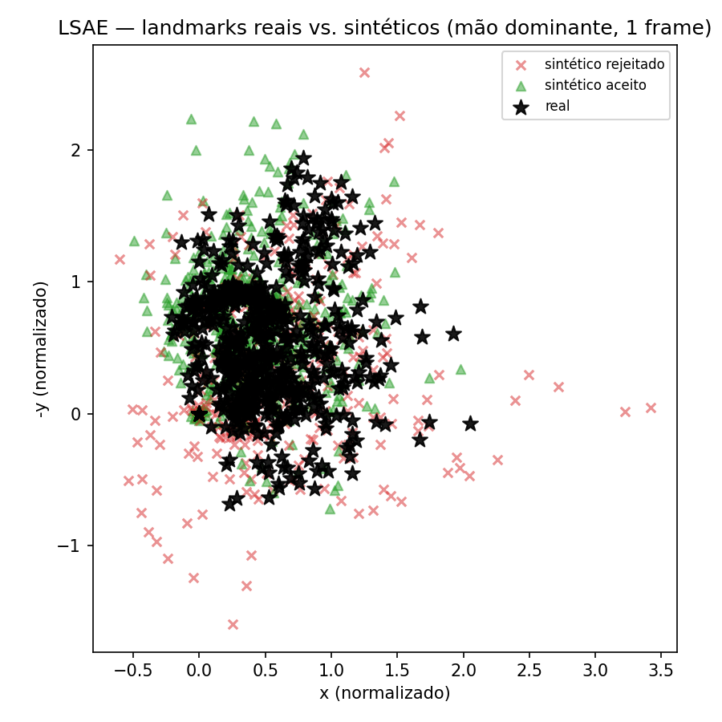

# LSAE — Demo do motor de geração + validação (prova de conceito)

Este é um demo executável, rodado sobre dados reais já coletados no KONECTA, do
núcleo técnico proposto no **LSAE (Libras Semantic Augmentation Engine)**: o
motor biomecânico de geração sintética (Pilar 2) e a validação estatística por
DTW (Etapa 6 do pipeline).

## O que o demo faz

1. Carrega execuções reais de um sinal do dataset (`OCR/dados_libras/dinamicos/<SINAL>`).
2. Gera variações sintéticas aplicando, em cima de cada execução real:
   - **reescala por "osso"** em torno do pulso — simula mão maior/menor entre pessoas;
   - **rotação 3D completa** em torno do pulso — simula ângulo de câmera diferente;
   - **jitter controlado** — simula pequena diferença de execução.
3. Gera também um pequeno grupo de variações **deliberadamente exageradas**
   (rotação de até 90°, reescala extrema, ruído alto) — não para uso real, mas
   para provar que a validação estatística de fato rejeita o que foge do padrão.
4. Valida cada amostra sintética por **distância DTW** até a execução real mais
   próxima, comparando contra o percentil da distância observada entre as
   próprias execuções reais do sinal. Só entra no "dataset aprovado" quem passa.
5. Gera duas figuras: landmarks reais vs. sintéticos aceitos/rejeitados, e o
   histograma de distâncias que fundamenta a decisão de aceitar/rejeitar.

## Resultado desta execução (sinal "AMOR", 30 execuções reais, 40 sintéticas geradas)

- 32 variações biomecânicas normais + 8 adversariais (stress-test do filtro)
- Limiar estatístico (percentil 75 da distância real↔real): **48.46**
- **25 aceitas (62%)** — plausíveis dentro da variação natural do sinal
- **15 rejeitadas (38%)** — a maioria das rejeições vem justamente do grupo
  adversarial, confirmando que o filtro discrimina variação plausível de
  distorção excessiva.




## Como rodar

```bash
pip install numpy matplotlib
python3 lsae_demo.py --sinal AMOR --dados-dir ../OCR/dados_libras/dinamicos --n-sinteticos 40
```

Funciona com qualquer sinal já presente em `dados_libras/dinamicos/<NOME>`.

## O que este demo NÃO prova (importante para não superestimar o resultado)

- **Não mede ganho de acurácia cross-signer.** Isso depende de retreinar o
  modelo de reconhecimento com o dataset expandido e avaliar num split de
  treino/teste separado por sinalizante — próxima etapa do plano, não parte
  deste demo.
- **A validação linguística (Etapa 5 do LSAE)** — checagem de que a variação
  não mudou configuração de mão, ponto de articulação, etc. — não está
  implementada aqui. Depende de um cadastro manual de faixas de tolerância por
  sinal que ainda não existe no dataset atual.
- O jitter usado é uma aproximação simplificada de perturbação em espaço
  articular (não é cinemática inversa/direta completa).

Este demo prova o mecanismo — geração biomecânica + filtro estatístico
funcionando sobre dado real — como base concreta para a próxima fase do TCC,
não o resultado final de generalização.

---

Projeto **KONECTA** — Reconhecimento Inteligente de Libras · Autor: Vinicius Rosa Santos
